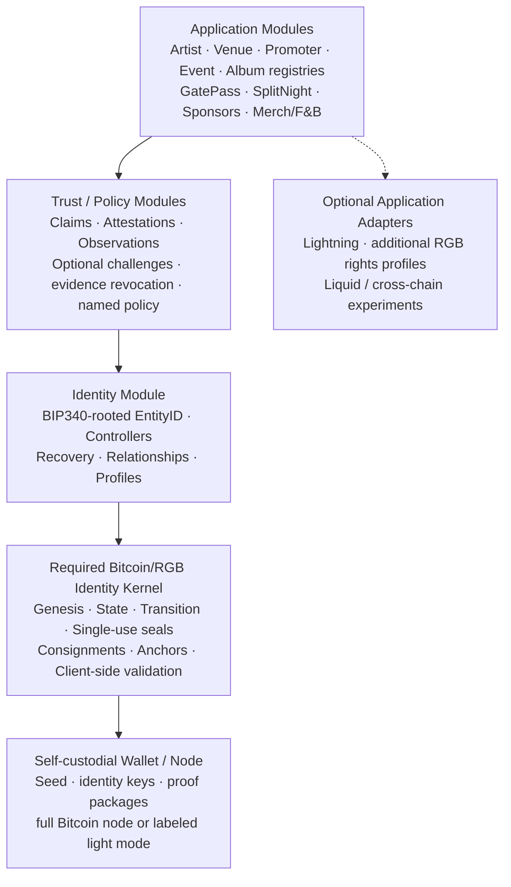

# 01 — Modular Layered Architecture

This is the foundational modular architecture proposed for O2A.



## Dependency invariant

```text
applications → registries/trust → identity → Bitcoin/RGB identity kernel → wallet/node
```

The reverse direction is forbidden. The kernel must never import Artist,
Venue, Ticket, or SplitNight semantics. Bitcoin/RGB lifecycle validation is
mandatory for every EntityID; optional application adapters cannot redefine it.
