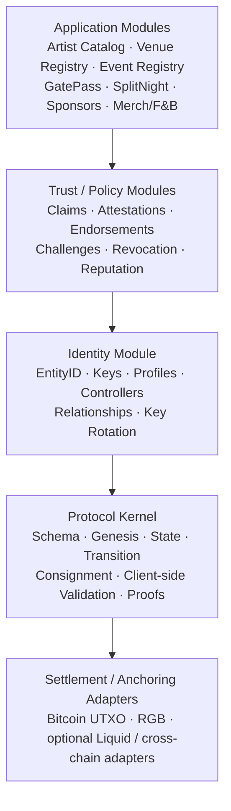

# 01 — Modular Layered Architecture

This is the foundational modular architecture proposed for O2A.



## Dependency invariant

```text
applications → registries/trust → identity → kernel → settlement adapters
```

The reverse direction is forbidden. The kernel must never import Artist, Venue, Ticket, or SplitNight semantics.
