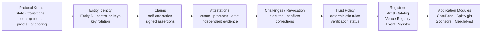
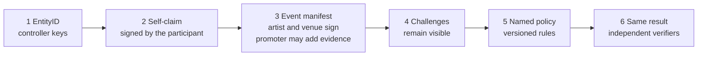
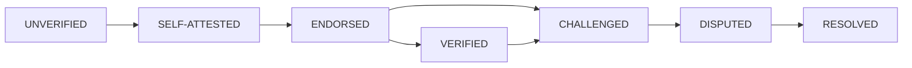

# 02 — End-to-End Protocol Flow

The first diagram is dependency order. A lower layer must not import an upper layer. A challenge is not a mandatory hop before every policy run; when a challenge or revocation exists, it stays in the evidence the policy has to explain.

## Operational Hello World

This is the first complete scenario. It matches the [roadmap](../13-roadmap.md) and the [vision](../00-vision.md). Booking, performance, and settlement remain distinct claims. A promoter statement is additional evidence, not a requirement for creating an EntityID.

Registries are rebuildable projections over that evidence. GatePass, SplitNight, and payment modules consume the result; they do not redefine identity.

## Verification-state lifecycle

## Principle

Applications consume protocol primitives; they do not redefine identity or trust.
