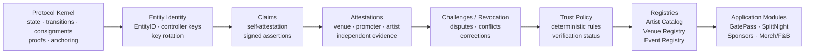
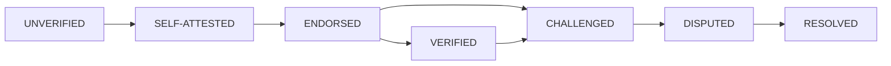

# 02 — End-to-End Protocol Flow

This diagram captures the proposed protocol path from generic state primitives to user-facing applications.

## Verification-state lifecycle

## Principle

Applications consume protocol primitives; they do not redefine identity or trust.
