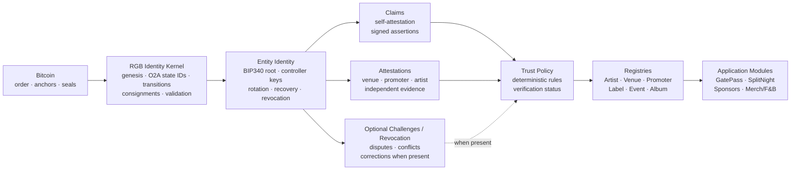
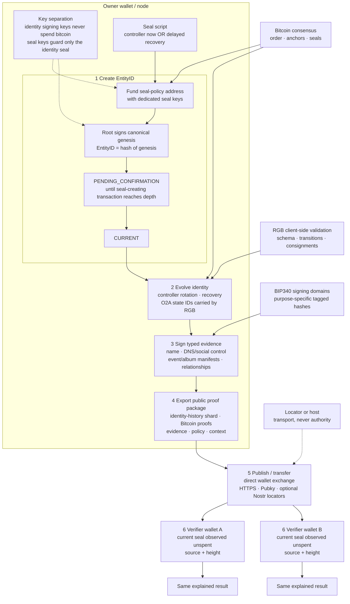

# 02 — End-to-End Protocol Flow

The first diagram is dependency order. A lower layer must not import an upper layer. A challenge is not a mandatory hop before every policy run; when a challenge or revocation exists, it stays in the evidence the policy has to explain.

```mermaid
flowchart LR
    B["Bitcoin<br/>order · anchors · seals"]
    K["RGB Identity Kernel<br/>genesis · O2A state IDs · transitions<br/>consignments · validation"]
    I["Entity Identity<br/>BIP340 root · controller keys<br/>rotation · recovery · revocation"]
    C["Claims<br/>self-attestation<br/>signed assertions"]
    A["Attestations<br/>venue · promoter · artist<br/>independent evidence"]
    X["Optional Challenges / Revocation<br/>disputes · conflicts<br/>corrections when present"]
    P["Trust Policy<br/>deterministic rules<br/>verification status"]
    R["Registries<br/>Artist · Venue · Promoter<br/>Label · Event · Album"]
    M["Application Modules<br/>GatePass · SplitNight<br/>Sponsors · Merch/F&B"]

    B --> K --> I
    I --> C --> P
    I --> A --> P
    I --> X
    X -. "when present" .-> P
    P --> R --> M
```

## Operational Hello World

This is the first complete scenario. It matches the [roadmap](../13-roadmap.md)
and the [vision](../00-vision.md). The CREATE sequence and confirmation state
reflect [ADR-0008](../../adr/0008-genesis-bound-entity-id.md); key separation
and the controller-or-delayed-recovery output reflect the
[entity schema](../../specs/entity-schema.md) and
[RGB identity contract](../../specs/rgb-identity-contract.md). O2A state IDs
carried by RGB reflect proposed
[ADR-0009](../../adr/0009-scoped-genesis-freeze.md), and the sourced unspent
observation reflects the
[verification policy](../../specs/verification-policy.md). Booking,
performance, and settlement remain distinct claims. A promoter statement is
additional evidence, not a requirement for creating an EntityID.

```mermaid
flowchart TB
    subgraph OWNER["Owner wallet / node"]
        subgraph CREATE["1 Create EntityID"]
            F["Fund seal-policy address<br/>with dedicated seal keys"]
            G["Root signs canonical genesis<br/>EntityID = hash of genesis"]
            PC["PENDING_CONFIRMATION<br/>until seal-creating transaction reaches depth"]
            CU["CURRENT"]
            F --> G --> PC --> CU
        end
        KS["Key separation<br/>identity signing keys never spend bitcoin<br/>seal keys guard only the identity seal"]
        SP["Seal script<br/>controller now OR delayed recovery"]
        L["2 Evolve identity<br/>controller rotation · recovery<br/>O2A state IDs carried by RGB"]
        S["3 Sign typed evidence<br/>name · DNS/social control<br/>event/album manifests · relationships"]
        PKG["4 Export public proof package<br/>identity-history shard · Bitcoin proofs<br/>evidence · policy · context"]
        KS -.-> F
        KS -.-> G
        SP --> F
        CU --> L --> S --> PKG
    end

    BTC["Bitcoin consensus<br/>order · anchors · seals"] --> F
    BTC --> L
    RGB["RGB client-side validation<br/>schema · transitions · consignments"] --> L
    TAG["BIP340 signing domains<br/>purpose-specific tagged hashes"] --> S

    PKG --> X["5 Publish / transfer<br/>direct wallet exchange<br/>HTTPS · Pubky · optional Nostr locators"]
    X --> V1["6 Verifier wallet A<br/>current seal observed unspent<br/>source + height"]
    X --> V2["6 Verifier wallet B<br/>current seal observed unspent<br/>source + height"]
    V1 --> R1["Same explained result"]
    V2 --> R2["Same explained result"]

    LOC["Locator or host<br/>transport, never authority"] -.-> X
```

Both verifier wallets check the package hash, Bitcoin proofs, RGB-carried O2A
state history, signatures and domains, evidence boundary, named policy,
protocol version, and evaluation context. Each evaluator also observes the
current seal as unspent and reports the Bitcoin-view source and height. Missing
history or unavailable referenced content produces an incomplete or invalid
result. Registries are rebuildable projections over the validated packages.
GatePass, SplitNight, and payment modules consume the result; they do not
redefine identity.

## Verification-state lifecycle

```mermaid
flowchart LR
    U["UNVERIFIED"] --> S["SELF-ATTESTED"] --> E["ENDORSED"] --> V["VERIFIED"]
    E --> CH["CHALLENGED"]
    V --> CH
    CH --> D["DISPUTED"] --> RS["RESOLVED"]
```

## Principle

Applications consume protocol primitives; they do not redefine identity or trust.
