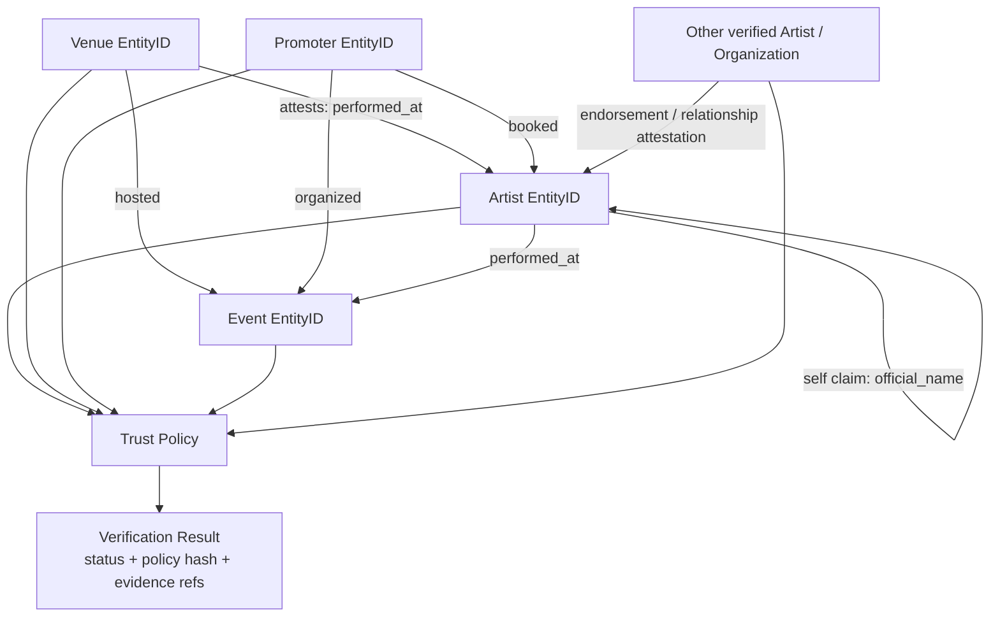
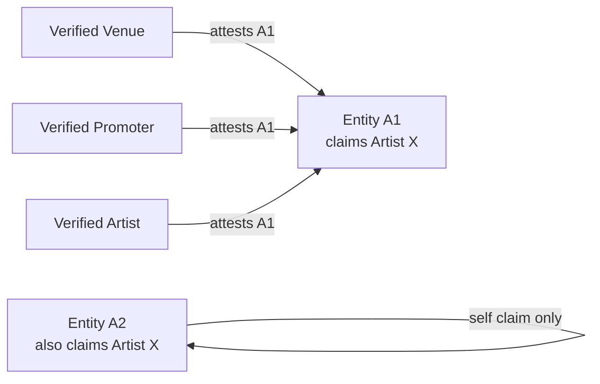

# 03 — Identity and Attestation Evidence Graph

The protocol does not create verification from a single centralized registrar. Verification emerges from independently signed evidence evaluated by policy.

## Identity collision example

The protocol preserves both claims. A verification policy determines how the available evidence is interpreted.
