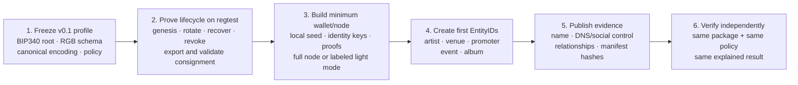
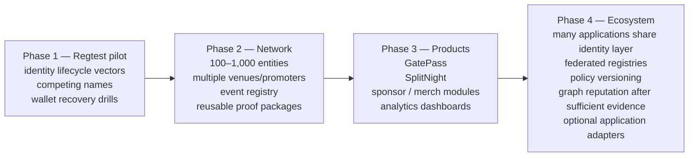

# 04 — Bootstrap and Scale

## Bootstrap / how to start


```mermaid
flowchart LR
    S1["1. Freeze v0.1 profile<br/>BIP340 root · RGB schema<br/>canonical encoding · policy"]
    S2["2. Prove lifecycle on regtest<br/>genesis · rotate · recover · revoke<br/>export and validate consignment"]
    S3["3. Build minimum wallet/node<br/>local seed · identity keys · proofs<br/>full node or labeled light mode"]
    S4["4. Create first EntityIDs<br/>artist · venue · promoter<br/>event · album"]
    S5["5. Publish evidence<br/>name · DNS/social control<br/>relationships · manifest hashes"]
    S6["6. Verify independently<br/>same package + same policy<br/>same explained result"]

    S1 --> S2 --> S3 --> S4 --> S5 --> S6
```

## Scale roadmap


```mermaid
flowchart LR
    P1["Phase 1 — Regtest pilot<br/>identity lifecycle vectors<br/>competing names<br/>wallet recovery drills"]
    P2["Phase 2 — Network<br/>100–1,000 entities<br/>multiple venues/promoters<br/>event registry<br/>reusable proof packages"]
    P3["Phase 3 — Products<br/>GatePass<br/>SplitNight<br/>sponsor / merch modules<br/>analytics dashboards"]
    P4["Phase 4 — Ecosystem<br/>many applications share identity layer<br/>federated registries<br/>policy versioning<br/>graph reputation after sufficient evidence<br/>optional application adapters"]

    P1 --> P2 --> P3 --> P4
```

## Scaling principle

```text
Scale by adding modules and evidence,
not by rewriting the identity layer.
```
