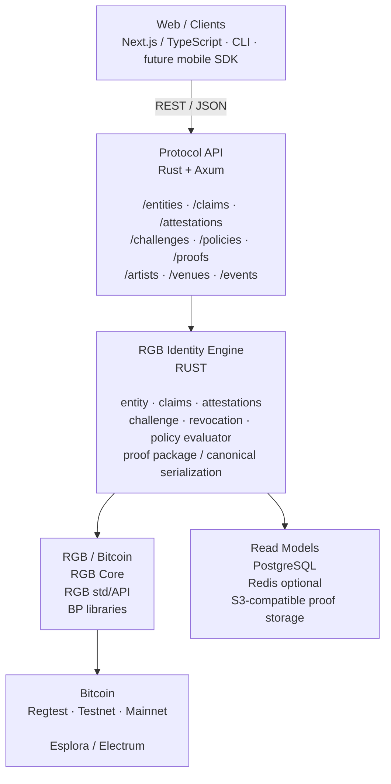

# 05 — Software Stack Architecture

This is the proposed implementation stack.



## Authority boundary

```text
Protocol / signed evidence     AUTHORITATIVE
PostgreSQL                     REBUILDABLE PROJECTION
Redis                          DISPOSABLE CACHE
Object storage                 PORTABLE EVIDENCE STORAGE
```
