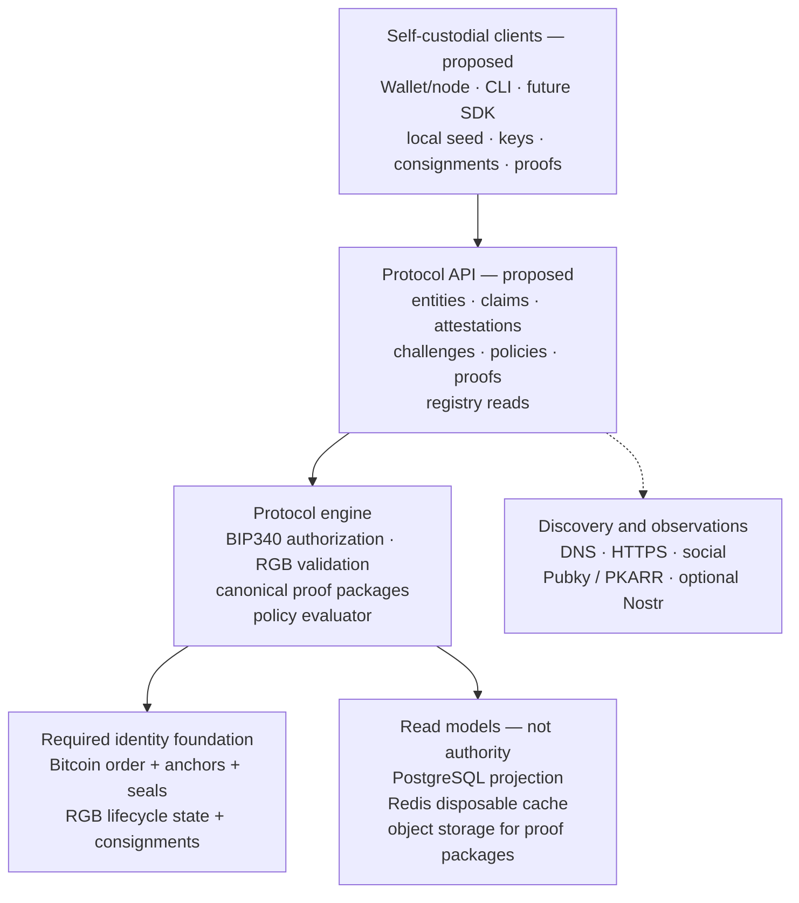

# 05 — Software Stack Architecture

This is the proposed implementation stack. It is not a running system, and it
does not choose a web framework or an HTTP library. Bitcoin anchoring and RGB
client-side validation are required for the EntityID lifecycle. DNS, social,
Pubky, Nostr, databases, and application services have narrower roles. See
[the architecture](../01-architecture.md) and [the roadmap](../13-roadmap.md).



## Authority boundary

```text
Bitcoin/RGB identity history           REQUIRED IDENTITY AUTHORITY
Signed evidence + versioned policy     REAL-WORLD CLAIM EVALUATION
PostgreSQL                             REBUILDABLE PROJECTION
Redis                                  DISPOSABLE CACHE
Object storage                         PORTABLE EVIDENCE STORAGE
Full node or labeled light mode        BITCOIN DATA ACCESS
Public profile / discovery             NOT A VERIFICATION INPUT BY ITSELF
```
