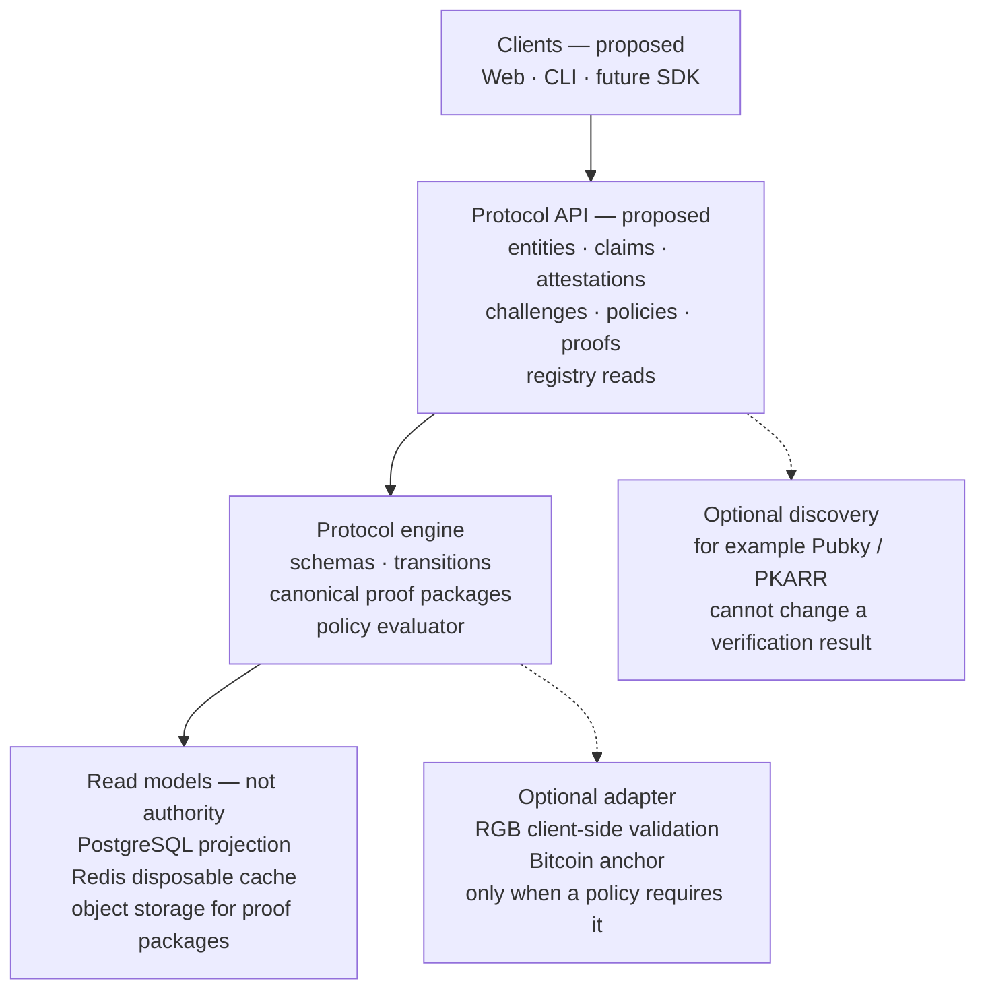

# 05 — Software Stack Architecture

This is the proposed implementation stack. It is not a running system, and it does not choose a web framework or an HTTP library. The protocol engine is not an RGB engine. RGB and Bitcoin are optional adapters: an identity result does not require them unless the selected policy explicitly demands that proof. See [the architecture](../01-architecture.md) and [the roadmap](../13-roadmap.md).



## Authority boundary

```text
Signed evidence + versioned policy     AUTHORITATIVE
PostgreSQL                             REBUILDABLE PROJECTION
Redis                                  DISPOSABLE CACHE
Object storage                         PORTABLE EVIDENCE STORAGE
RGB / Bitcoin proof                    ONLY WHEN THE POLICY REQUIRES IT
Public profile / discovery             NOT A VERIFICATION INPUT BY ITSELF
```
