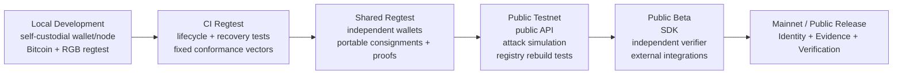
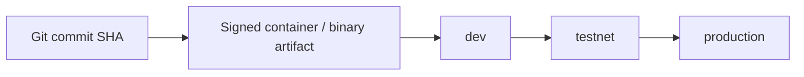

# 06 — Development-to-Public-Release Pipeline

The proposed deployment progression adds two controlled environments between local development and production. The project is still in specification, so these stages are design targets rather than a running deployment.



## Promotion model



The intended discipline is to promote the same tested artifact rather than rebuilding a different production binary.

## First mainnet scope

```text
Entity
RGB identity lifecycle
Bitcoin anchors and seals
Claim
Attestation
Challenge
Revocation
Trust Policy
Artist Registry
Venue Registry
Event Registry
Album Registry
```

GatePass and SplitNight should follow protocol stability rather than block the first public identity release.
