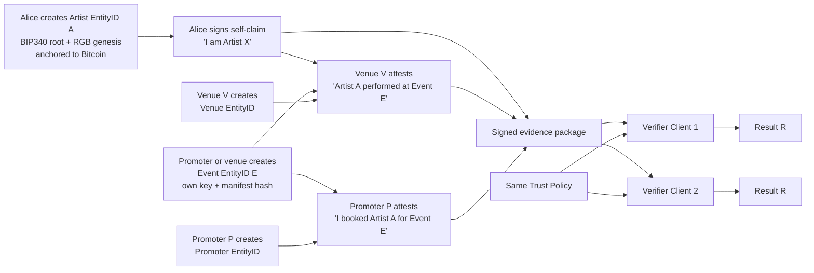

# 07 — Hello-World Pilot

This is the smallest scenario that demonstrates O2A as a protocol rather than a centralized database.



## Success condition

```text
same evidence
+ same policy
+ same protocol version
= same verification result
```

This is the primary deterministic compatibility invariant for independent implementations.
