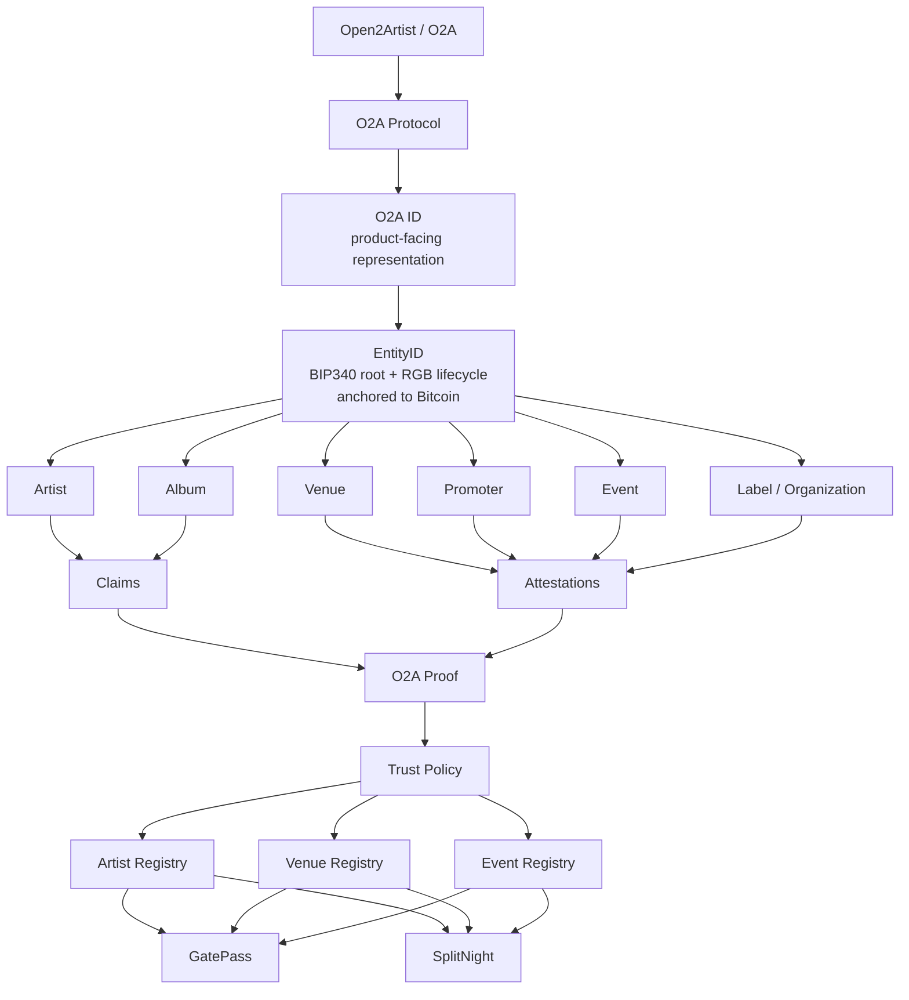

# 08 — O2A Ecosystem and Namespace Map

This diagram captures the later Open2Artist naming/architecture concept without changing the generic EntityID protocol design.



## Naming boundary

```text
O2A ID    = human/product-facing identity
EntityID  = public-key-rooted protocol primitive with a Bitcoin/RGB lifecycle
```

This preserves an artist-focused go-to-market without restricting the protocol to artists only.
