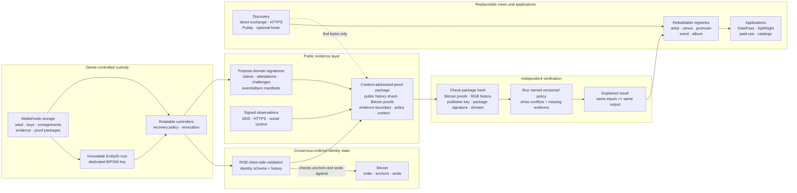

# 09 — Protocol Framework and Authority Boundaries

This framework view shows what each subsystem can prove and which components
remain replaceable. Solid arrows point from a dependent operation to the
prerequisite it must validate or consume; they do not transfer authority.

## What each boundary establishes

| Boundary | Establishes | Does not establish |
| --- | --- | --- |
| Bitcoin | transaction order, confirmations, commitments, spent seals | who is the real artist or owner of a spoken name |
| RGB | validity of the supplied O2A identity state transition history | truth of DNS, social, event, album, or relationship claims |
| BIP340 O2A signature | authorship and integrity in one purpose-specific domain | exclusive name ownership or signer independence |
| Evidence policy | an explained result over explicit evidence and context | authority to rewrite identity history |
| Discovery and registries | finding packages and presenting rebuildable views | identity, consensus, or verification authority |

The immutable root identifies the EntityID. Controller keys authorize ordinary
operations and can rotate under validated RGB state. Bitcoin spending keys,
Pubky Ed25519 keys, Nostr publication keys, and payment endpoints remain
separate and may only be connected through explicit signed bindings.
